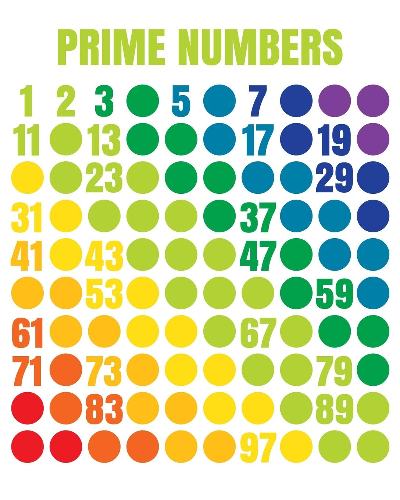

# 
 Nested `For`: Counting Primes

[Hengfeng Wei (魏恒峰)](https://hengxin.github.io/)
hfwei@nju.edu.cn

Oct. 28, 2022

---
# Review
 
 

### For Statement (`for` 语句)

 

### Array (数组)

---
# Overview
 
 

### Nested `for` (More Examples)
 

### `break` Statement

---

## <mark>primes.c</mark>

---
# Prime Numbers (`primes.c`)

---
